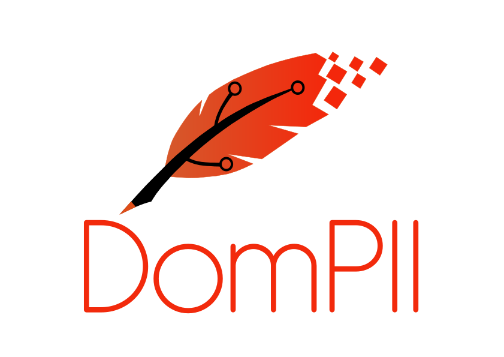

  

  
  
  
  
  
  
  
  
  
  

<h1 align="center">DomPII</h1>

<em>A modular AI-powered platform for self-directed learning, autonomy, and cognitive exploration.</em>

  🌐 <strong><a href="https://dompii.com">Visit dompii.com</a></strong> for the official website and platform access.

---

## 🌐 Overview

**DomPII** is an open-source educational ecosystem designed for autonomous learning. The platform empowers users to create their own cognitive paths by combining artificial intelligence, dynamic UI rendering, and modular protocol-based tools.

Rather than being a static learning system, DomPII functions as an **adaptive mind extension** — capable of generating quizzes, visualizations, timelines, and learning flows dynamically, through a protocol called **MCP (Model Context Protocol)**.

This repository serves as the central hub for all DomPII-related modules.

---

## 📦 Repositories

| Project                         | Description                                                             |
|---------------------------------|-------------------------------------------------------------------------|
| [`dompii-web-vue`](https://github.com/Arateki/dompii-web-vue)         | The main frontend interface, built with Vue.js.                        |
| [`dompii-api-node`](https://github.com/Arateki/dompii-api-node)       | Node.js backend for data orchestration, user sessions, and APIs.      |
| [`dompii-mcp-python`](https://github.com/Arateki/dompii-mcp-python)   | Python implementation of MCPs for AI, LLM orchestration, and NLP.     |
| [`dompii-mcp-node`](https://github.com/Arateki/dompii-mcp-node)       | Node.js MCPs for canvas control, quiz generation, and HTML rendering. |

---

## 📘 Whitepaper

Curious about the philosophy and modular architecture behind DomPII?

👉 Read the full [Whitepaper](./docs/dompii-whitepaper_en.pdf) to explore how DomPII redefines self-directed learning using AI, the Model Context Protocol (MCP), and knowledge graph integration.

---

## 🧠 Architecture Highlights

- **MCP-based UI generation**: Interfaces are not hardcoded — they are generated by the AI in real-time via Model Context Protocols.
- **Canvas rendering**: Each screen is a programmable canvas powered by JSON inputs.
- **Knowledge integration**: PostgreSQL for user data, MongoDB for temporal interaction logs, Neo4j for semantic graphs.
- **User modes**: “Specialist” (focused domain learning) or “Polymath” (exploratory learning across disciplines).

---

## 🚀 Getting Started

To run DomPII locally or in production, clone and run the individual modules listed above. This repository acts as the landing page and documentation gateway.

Looking for the platform itself? Head over to [**dompii.com**](https://dompii.com).

---

## 🤝 Contributing

We welcome code, ideas, issue reports, and documentation improvements.

> Contribution guidelines and issue templates will be added soon.

---

## 📄 License

MIT License – See [`LICENSE`](./LICENSE) for full details.

---

  Built by <a href="https://github.com/Arateki">Arateki</a> — empowering autodidacts worldwide.

